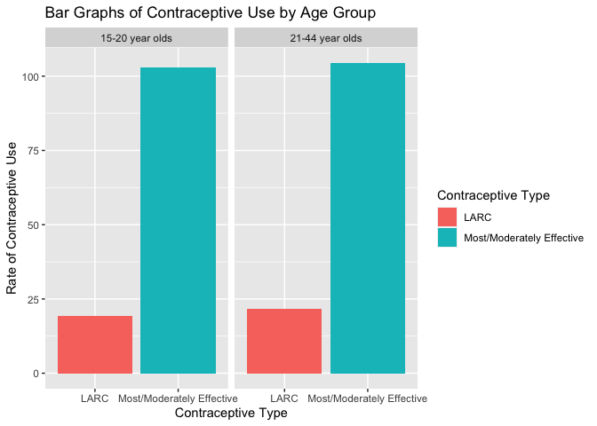

Midterm Project
================
Megan Tran
October 23, 2022

``` r
library(lubridate)
```

    ## 
    ## Attaching package: 'lubridate'

    ## The following objects are masked from 'package:base':
    ## 
    ##     date, intersect, setdiff, union

``` r
library(tidyverse)
```

    ## ── Attaching packages
    ## ───────────────────────────────────────
    ## tidyverse 1.3.2 ──

    ## ✔ ggplot2 3.3.6     ✔ purrr   0.3.4
    ## ✔ tibble  3.1.8     ✔ dplyr   1.0.9
    ## ✔ tidyr   1.2.0     ✔ stringr 1.4.1
    ## ✔ readr   2.1.2     ✔ forcats 0.5.2
    ## ── Conflicts ────────────────────────────────────────── tidyverse_conflicts() ──
    ## ✖ lubridate::as.difftime() masks base::as.difftime()
    ## ✖ lubridate::date()        masks base::date()
    ## ✖ dplyr::filter()          masks stats::filter()
    ## ✖ lubridate::intersect()   masks base::intersect()
    ## ✖ dplyr::lag()             masks stats::lag()
    ## ✖ lubridate::setdiff()     masks base::setdiff()
    ## ✖ lubridate::union()       masks base::union()

``` r
library(data.table)
```

    ## 
    ## Attaching package: 'data.table'
    ## 
    ## The following objects are masked from 'package:dplyr':
    ## 
    ##     between, first, last
    ## 
    ## The following object is masked from 'package:purrr':
    ## 
    ##     transpose
    ## 
    ## The following objects are masked from 'package:lubridate':
    ## 
    ##     hour, isoweek, mday, minute, month, quarter, second, wday, week,
    ##     yday, year

``` r
library(ggplot2)
library(dtplyr)
library(dplyr)
library(stringr)
```

\#Introduction

The Contraceptive Care - All Women measure (CCW), as part of the
Maternal and Infant Health Initiative, Contraceptive Care Quality grant,
was compiled data from all women ages 15-44 at risk for unintended
pregnancy. The women were stratified in two age groups, those who are
15-20 and those who are 21-44. Contraceptive type either fell under the
category of long-acting reversible methods of contraception (LARC), such
as birth control implants or IUDs, or most/moderately effective methods
of contraceptions (M/M), such as oral pills, patches, rings,
injectables, female sterilization, or diaphragms. Data was gathered in
the U.S. for 3 consecutive years, 2014-2016. Furthermore, “Rate of
contraceptive use” in the dataset refers to those who use a type of
contraceptive divided by those who are “eligible”, or at risk for
pregnancy.

LARC contraceptives are more effective forms of birth control than M/M
methods and are safe for women of all ages to use. LARC methods could
prevent more cases of teenage pregnancy for young women at risk and who
are sexually active. However, M/M methods are considered to be more
traditional and may be perceived by the public to be safer since they
don’t require surgical insertions of long-term devices into the body.
Young women who have not received enough information about the different
available contraceptive methods may not be able to make an informed
decision on the contraception that’s right for them.

The research question being explored is if younger women (age 15-20) use
long-acting reversible methods of contraception (LARC) less than older
women (age 21-44) and is that trend consistent throughout the three year
period?

\#Methods (include how and where the data were acquired, how you cleaned
and wrangled the data, what tools you used for data exploration)

The data was collected through administrative survey measures. The
representative sample excluded U.S. women not at risk of unintended
pregnancy because they were infecund for non-contraceptive reasons, had
a live birth in the last 2 months of the measurement year, or were
pregnant or their pregnancy outcome was unknown at the end of the
year(s). Once the exclusions were applied, the sample included women who
were not pregnant at any point in the 3-year period, those who had a
live birth in the first 10 months of the measurement year(s), and those
who had a miscarriage, stillbirth, ectopic pregnancy, or induced
abortion.

Reading in the data:

``` r
if (!file.exists("ofp-ccw-by-race-ethn_contra-type_age-group_14-16.csv")) {
download.file("https://data.chhs.ca.gov/dataset/c2698502-d276-4e55-9057-8153e39d21b1/resource/12a73f54-dcf4-4e38-843c-e988385be69b/download/ofp-ccw-by-race-ethn_contra-type_age-group_14-16.csv", "ofp-ccw-by-race-ethn_contra-type_age-group_14-16.csv", method="libcurl", timeout = 60) 
}
contra <- data.table::fread("ofp-ccw-by-race-ethn_contra-type_age-group_14-16.csv") 
```

First, the number of missing values were checked. There were no missing
values in the dataset so there was no need to remove observations or
impute data.

``` r
mean(is.na(contra))
```

    ## [1] 0

A regular expression was used in order to remove the “%” symbol from the
“Rate of Contraceptive Use” column.

``` r
contra$`Rate of Contraceptive Use` <- stringr::str_remove_all(contra$`Rate of Contraceptive Use`, "%")
```

Then the column was changed from a character variable to numeric.

``` r
contra$`Rate of Contraceptive Use` <- as.numeric(contra$`Rate of Contraceptive Use`)
```

There’s a wide range between the maximum and minimum rates.

``` r
summary(contra$`Rate of Contraceptive Use`)
```

    ##    Min. 1st Qu.  Median    Mean 3rd Qu.    Max. 
    ##   2.320   6.975  12.270  20.669  35.610  53.310

The average of the rates of contraceptive use was calculated by
contraceptive type, age group, and year. The variable “avg_rate” was
created.

``` r
avg_contra <- contra[ , .(
    avg_rate = mean (`Rate of Contraceptive Use`)
  ), 
  by = .(`Contraceptive Type`, `Age Group`, Year)]

avg_contra
```

    ##            Contraceptive Type       Age Group Year  avg_rate
    ##  1: Most/Moderately Effective 15-20 year olds 2014 38.765000
    ##  2:                      LARC 15-20 year olds 2014  8.635000
    ##  3: Most/Moderately Effective 21-44 year olds 2014 42.683333
    ##  4:                      LARC 21-44 year olds 2014  8.290000
    ##  5:                      LARC 21-44 year olds 2015  6.785714
    ##  6: Most/Moderately Effective 15-20 year olds 2015 32.613333
    ##  7:                      LARC 15-20 year olds 2015  5.605000
    ##  8: Most/Moderately Effective 21-44 year olds 2015 31.471667
    ##  9: Most/Moderately Effective 15-20 year olds 2016 31.408333
    ## 10:                      LARC 15-20 year olds 2016  5.156667
    ## 11: Most/Moderately Effective 21-44 year olds 2016 30.286667
    ## 12:                      LARC 21-44 year olds 2016  6.576667

\#Preliminary Results

``` r
avg_contra[!is.na(`avg_rate`)] %>% 
  ggplot()+
  geom_col(mapping=aes(x=`Contraceptive Type`, y= `avg_rate`, fill = `Contraceptive Type`)) +
   labs(title = "Bar Graphs of Contraceptive Use by Age Group") +
  labs( y = "Rate of Contraceptive Use") +
    facet_wrap( ~`Age Group`)
```

<!-- --> These bar
graphs show the rates of contraceptive use, LARC or Most/Moderately
Effective methods, per age group. The figure shows that older women use
LARC methods at a slightly higher rate. Since these bar graphs are so
similar, I want to see if the graphs look any different when I split
them into years. Perhaps, a different trend will appear.

``` r
avg_contra[!is.na(`avg_rate`)] %>% 
  ggplot()+
  geom_col(mapping=aes(x=`Contraceptive Type`, y= `avg_rate`, fill = `Contraceptive Type`)) +
   labs(title = "Bar Graphs of Contraceptive Use by Year and Age Group") +
   facet_wrap(Year ~ `Age Group`, nrow=3)
```

<!-- --> These bar
graphs split the data by year. Interestingly enough, older women used
LARC methods at a lower rate than younger women in 2014. In the next two
years, you can observe that the rates for 15-20 year olds decreased.
These graphs give us a better idea of how the rate distribution changes
for the two age groups over the years. They suggest that time might be
confounder in the association between contraceptive type and age group
since the trend is different for different years.

``` r
contra[!is.na(`Rate of Contraceptive Use`)] %>% 
  ggplot()+
  geom_boxplot(mapping=aes(x=`Contraceptive Type`, y=`Rate of Contraceptive Use`, fill = `Contraceptive Type`)) +
   labs(title = "Boxplots of Contraceptive Use by Year and Age Group") + 
    facet_wrap(Year ~ `Age Group`, nrow=3)
```

<!-- --> Again, the
boxplots depict the distribution of contraceptive rates by year, age
group, and contraceptive type. Similar to the bar graphs, these boxplots
confirm that the median LARC contraceptive use rates for younger women
are only higher than for older women only in 2014. The opposite is true
for the next two years. There seems to be an outlier for LARC
contraceptive types in 2015 for 21-44 year olds. By examining the data
more closely, we can see that the outlier is not concerning because it
comes from the “Other Asian/Pacific Islander” racial group and they
consistently have higher rates throughout the dataset.

``` r
database <- data.frame(
    Year = avg_contra$Year, 
   Contraceptive_Type = avg_contra$`Contraceptive Type`,
    Age_Group = avg_contra$`Age Group`,
   Average_Rate_of_Contraceptive_Use = avg_contra$avg_rate
 )
 knitr::kable(database, caption = "Contraceptive Use of Women 2014-2016")
```

| Year | Contraceptive_Type        | Age_Group       | Average_Rate_of_Contraceptive_Use |
|-----:|:--------------------------|:----------------|----------------------------------:|
| 2014 | Most/Moderately Effective | 15-20 year olds |                         38.765000 |
| 2014 | LARC                      | 15-20 year olds |                          8.635000 |
| 2014 | Most/Moderately Effective | 21-44 year olds |                         42.683333 |
| 2014 | LARC                      | 21-44 year olds |                          8.290000 |
| 2015 | LARC                      | 21-44 year olds |                          6.785714 |
| 2015 | Most/Moderately Effective | 15-20 year olds |                         32.613333 |
| 2015 | LARC                      | 15-20 year olds |                          5.605000 |
| 2015 | Most/Moderately Effective | 21-44 year olds |                         31.471667 |
| 2016 | Most/Moderately Effective | 15-20 year olds |                         31.408333 |
| 2016 | LARC                      | 15-20 year olds |                          5.156667 |
| 2016 | Most/Moderately Effective | 21-44 year olds |                         30.286667 |
| 2016 | LARC                      | 21-44 year olds |                          6.576667 |

Contraceptive Use of Women 2014-2016

\#Conclusion

Although statistical analyses should be conducted in order to determine
a more accurate conclusion, we can look at the figures and table to
reach a preliminary conclusion. In reference to the formulated research
question, younger women do indeed use LARC contraceptive methods at a
lower rate than older women, but this was not true for all 3 years,
2014-2016. In 2014, younger women actually had higher rates for LARC
contraceptive use. More research should be conducted as to why there was
a change between 2014 and 2015 and if the trend has held the same past
2016. Introducing LARC contraceptive methods to younger women could
reduce unwanted pregnancies and offer alternative, long-term
contraception options.
